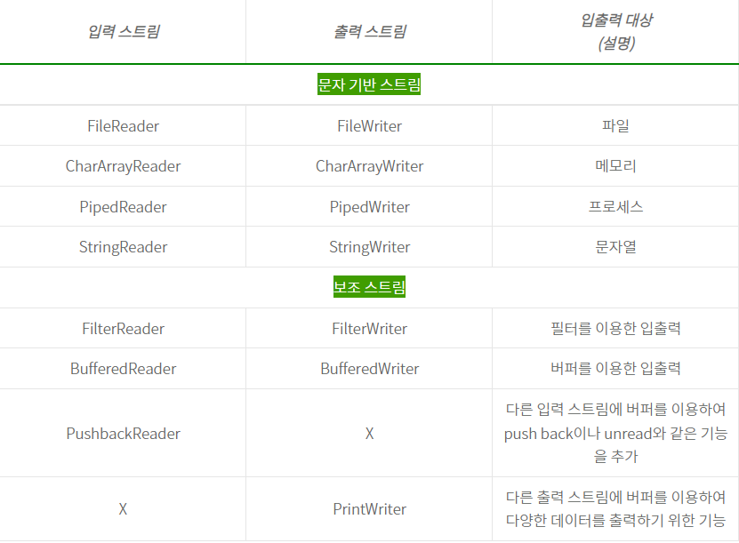

# JAVA Input / Output [자바 입출력]

1. Java I/O
   1) I/O 스트림
   : 단방향 통신을 지원하는 기능. 서로 통신을 위한 Input Stream과 Output Stream 2개의 Stream이 필요. 출발지에서 도착지로 데이터를 운반하는 통로.
  
   2) I/O란?
   : 내부 또는 외부 장치와 프로그램 간의 데이터를 전송 가능하게 하는 지점.
  
   3) Stream이란?
   : 운영체제에 의해 생성되는 가상의 연결고리. 데이터의 이상화된 흐름. 데이터를 운반하는 연결 통로.
  
   4) Stream의 흐름
   : 큐(Queue)와 같은 선입선출(FIFO) 형태로 데이터가 전송.

2. I/O Stream의 구조

   Source → Input Stream → 데이터 조작 → Output Stream → Destination

    Source : 데이터 근원지
    Input Stream : 자바 입력 통로
    데이터 조작 : 사용자가 직접 핸들링하여 데이터를 조작하는 구간
    Output Stream : 자바 출력 통로
    Output Stream : 데이터 종착점

3. I/O Stream 종류
   1) 바이트 입출력 스트림 : 1byte 단위 처리 / 영상, 음성, 영문자의 binary 데이터를 처리
   2) 문자 입출력 스트림  : 2byte 단위 처리 / binary 데이터 처리 불가

4. I/O Stream 구조
   자바에서는 java.io 패키지를 통해 InputStream과 OutputStream 클래스를 별도로 제공함. 즉, 자바에서의 스트림 생성이란? 스트림 클래스 타입의 인스턴스를 생성한다는 의미

    1) 바이트 입출력 스트림
       - 바이트 기반 스트림: 데이터가 이동하는 통로를 직접 만드는 클래스
       - 보조 스트림 : 이미 만들어져 있는 통로에 새로운 기능을 추가하는 클래스
    
    2) 문자 입출력 스트림

       - 문자 기반 스트림: 다국어 특성상 2 Byte를 사용하여 클래스 변경됨
       
            InputStream -> Reader
       
            OutputStream -> Writer
       - 보조 스트림: 이미 만들어져 있는 통로에 새로운 기능을 추가하는 클래스 
       

