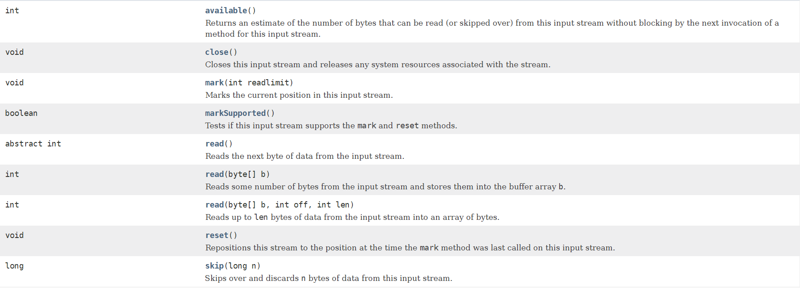
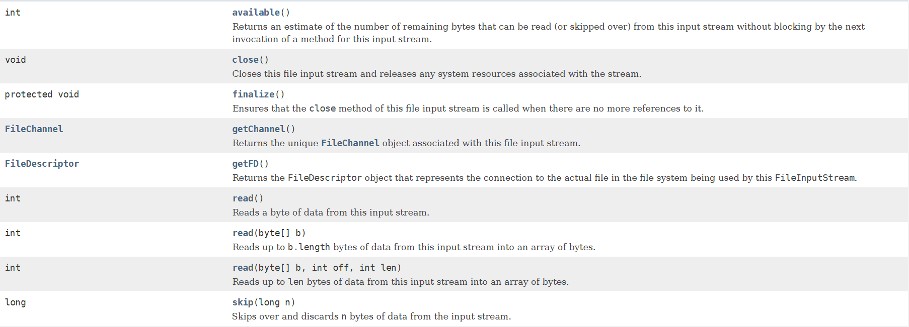
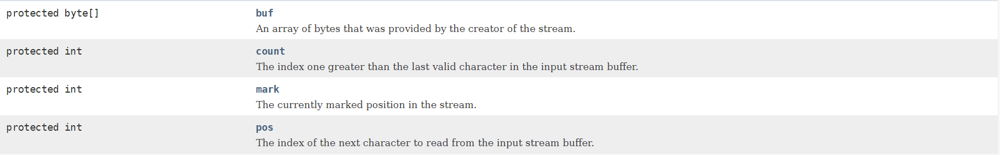
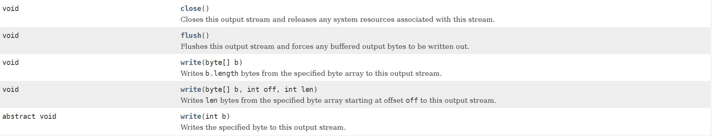
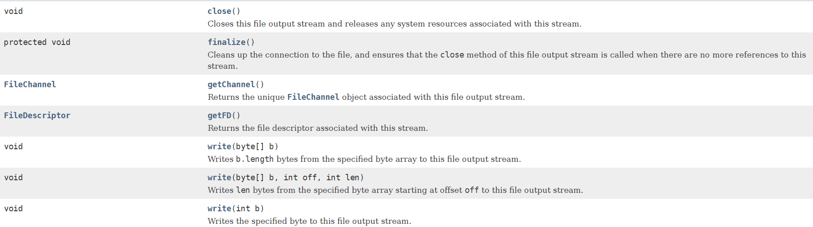
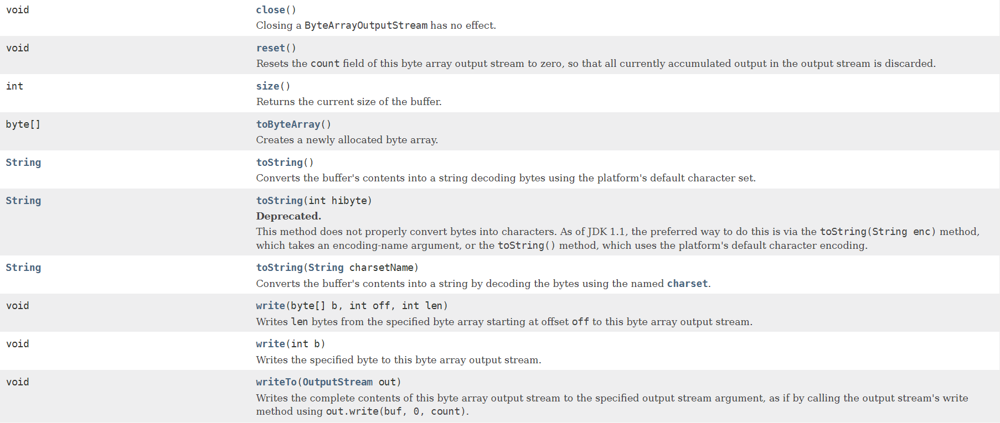
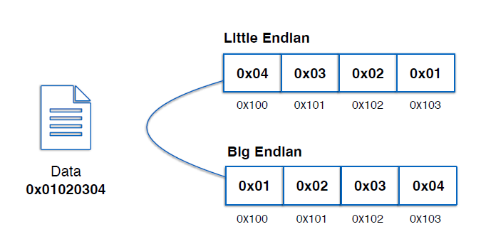

# InputStream
## Method

# FileInputStream
## Method

# ByteArrayInputStream
## Method

# OutputStream
## Method

# FileOutputStream
## Method

# ByteArrayOutputStream
## Method

# 엔디안
    1. 엔디안(Endianness)
        - 컴퓨터의 메모리와 같은 1차원의 공간에 여러 개의 연속된 대상을 배열하는 방법을 뜻한다.
        - 바이트를 배열하는 방법을 특히 바이트 순서(Byte order)라 한다.
    2. 빅 엔디안(Big-Endian)
        - 최상위 바이트(MSB, Most Significant Byte)부터 차례로 저장하는 방식
        - 큰 단위의 바이트가 앞에 오는 방법
        - <- 높은주소 --- 낮은 주소 >
    3. 리틀 엔디안 (Little-Endian)
        - 최하위 바이트(LSB, Least Significant Byte)부터 차례로 저장하는 방식
        - 작은 단위의 바이트가 앞에 오는 방법
        - <- 낮은 주소 --- 높은 주소 >

[참고 사이트](https://catsbi.oopy.io/20112bd1-0d38-48ab-b8bc-c01fded65fab)