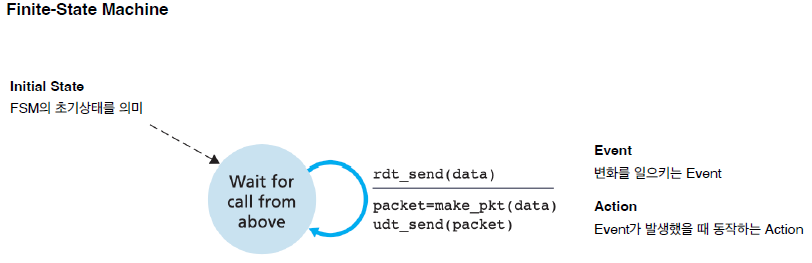
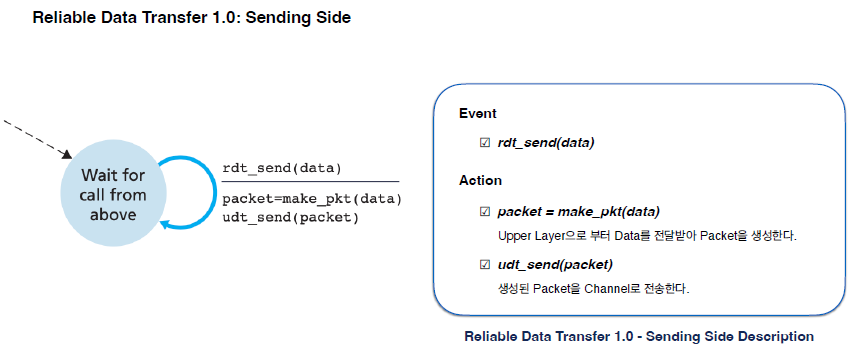
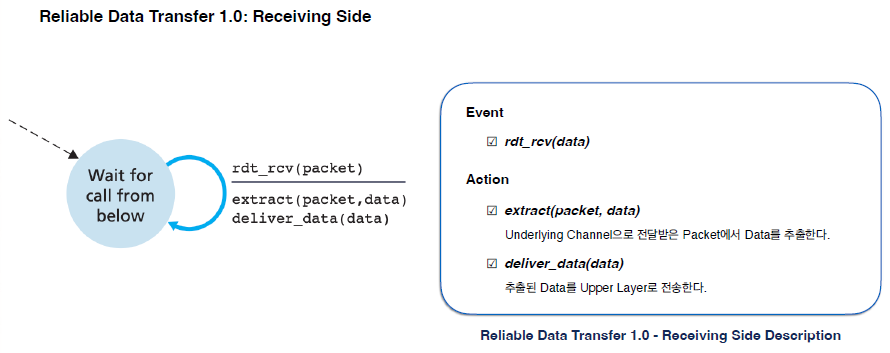
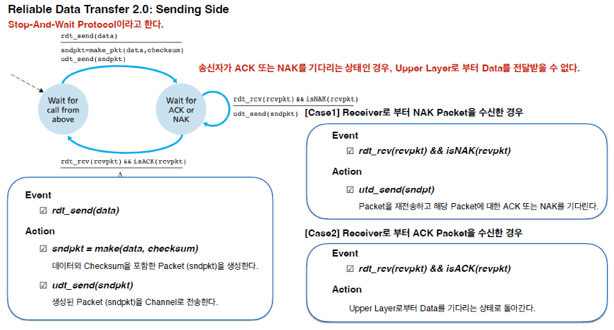
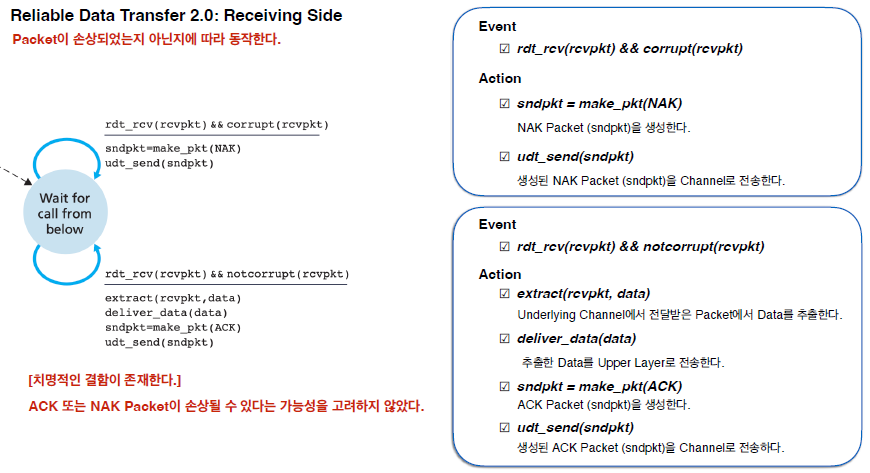
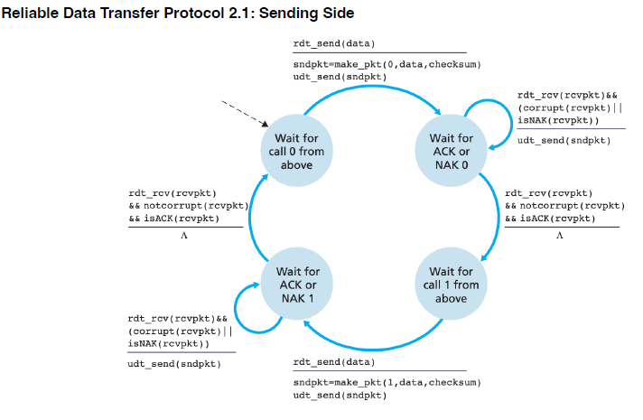
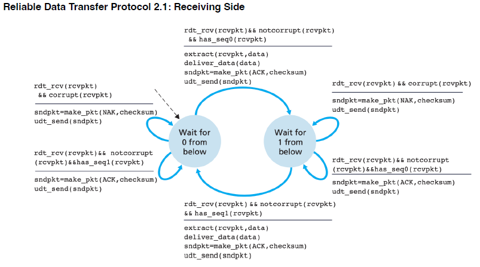
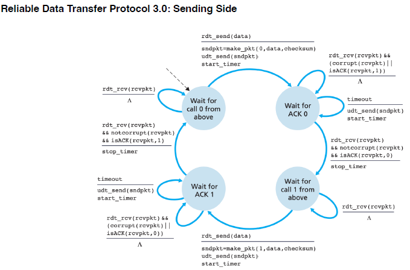
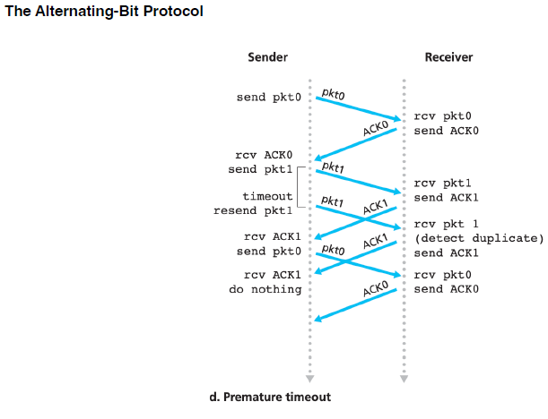

# NetworkProgramming

참고자료

1. UDP 통신 소켓프로그래밍
   https://coding-factory.tistory.com/271
2. Java Stream
3. TCP 통신 소켓프로그래밍

# Folder

1. [UDP](mdfiles/1.%20UDP.md)
2. [Java Stream](mdfiles/2.%20Java%20Input,Output.md)
3. [TCP](mdfiles/3.%20TCP.md)
4. [InternetProtocol](mdfiles/4.%20InternetProtocol.md)

※과제 : ByteArrayEx02 참고

## Principles of Reliable Data Transfer

    1. 전송된 Data가 손상되지 않는다.
    2. 모든 Data는 전송된 순서대로 전달된다.

### Finite - State Machine

### Reliable Data Transfer over a Perfectly Reliable Channel: rdt1.0

☑ Data 단위와 Packet 단위의 차이가 존재하지 않는다.

☑ 모든 Packet의 흐름은 송신자와 수신자 간에 발생한다.

☑ 완전히 신뢰적인 채널 (Perfectly Reliable Channel)이기 때문에 오류가 발생하지 않는다.

☑ 즉, 수신자는 송신자에게 Feedback을 제공할 필요기 없다.

☑ 송신자가 Data를 송신하자마자 Data를 수신할 수 있다고 가정했다.

☑ 즉, 수신자는 송신자에게 Data를 천천히 송신하라고 요청할 필요가 없다.

### Reliable Data Transfer over a Channel with Bit Errors: rdt2.0

ARQ(Automatic Repeat reQuest) Protocol
: 재전송을 기반으로 신뢰성 있는 Data 전송을 가능하게 하는 Protocol이다.
☑ Positive Acknowledgment : Data를 정확하게 수신되었는지 확인하는 용도로 사용

☑ Negative Acknowledgment : Data가 잘못 수신되어 재전송이 필요하다고 수신자가 송신자에게 알려주는 용도로 사용

ARQ를 위한 3가지의 Additional protocol Capabilites

    1. Error Detection (From Receiver)
    2. Receiver Feedback (From Receiver)
    3. Re-transmission (From Sender)

### Reliable Data Transfer over a Channel with Bit Errors: rdt2.1

Sequence Number를 도입하여 문제 해결

    - 동일 SeqN : 수신자는 송신자의 Packet 재전송을 인지할 수 있다.
    - 다른 SeqN : 수신자는 송신자로부터 새로운 Packet을 수신했다고 인지할 수 있다.

### Reliable Data Transfer over a Lossy Channel with Bit Errors: rdt3.0

Sequence Number를 도입하여 문제 해결한 줄 알았으나, ACK, NACK 패킷의 손실은 어떻게 해결?

    → Timer 사용

