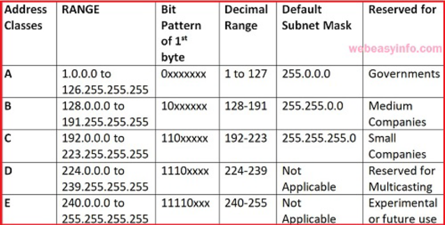
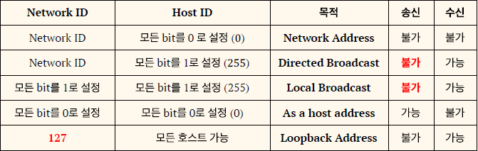

# IP Address

* IP (Internet Protocol)
  : 인터넷상에서 데이터를 송수신할 목적으로 컴퓨터에게 부여하는 값을 의미한다.

## 1. 인터넷 주소

    - IPv4 (4바이트 주소 체계)
    - IPv6 (16바이트 주소 체계)

1)

## 2. IP Address 관리 기법

### 2.1 IP 주소 체계

- TCP/IP Network에서 사용되는 모든 장비들은 고유한 논리적인 네트워크 식별자를 갖으며 이를 IP주소라고 한다.

1) 클래스별 분류

- IP 주소는 32 bit로 구성되며 IP주소를 4개의 Byte로 나누고 각각의 바이트를 10진수로 표기하는 방식을 사용한다.
- Structure : | Network ID | Host ID |
    1) 네트워크 주소 (네트워크 ID)
        - 네트워크 구분을 위한 IP주소의 일부
        - 네트워크로 데이터가 전송된다는 것은 네트워크를 구성하는 라우터(Router) 또는 스위치(Switch)로 데이터가 전송됨을 뜻한다.
        - 그러면 데이터를 전송 받은 라우터는 데이터에 적혀있는 호스트 주소를 참조하여 호스트에 데이터를 전송해준다.
-
    2) Host ID
        - 호스트를 구별하기 위한 호스트 식별자이다.
- 네트워크 주소와 호스트(컴퓨터를 의미) 주소로 나뉘며, 주소의 형태에 따라서 A,B,C,D,E 클래스로 분류가 된다.

2) 전송방법에 따른 분류
    1. Unicast (1:1)
       - 하나의 송신자가 하나의 수신자에게 Packet을 전송하는 방식
    2. Multicast (1:n)
        - 하나의 송신자가 다수의 수신자에게 Packet을 전송하는 방식
        - Multicast 전송을 하기 위해서는 네트워크 장치가 Multicast를 지원해야하며 원하는 Group에 가입되어 있어야 한다.
    3. Broadcast
        - 하나의 송신자가 모든 수신자에게 Packet을 전송하는 방식으로 Broadcast를 위해서 Host ID를 모두 1로 설정해야 한다. 

3) 특별한 IP 주소
   
    1. Network Address
    2. Directed Broadcast Address
    3. Local Broadcast
    4. As a Host Address
    5. Loopback Address

## 2.2 IP 주소 관리 방식
    - 낭비되는 IP를 줄이기 위한 Subnetting
    - 부족한 IP주소를 효율적으로 사용하기 위한 Supernetting
    - Class를 구분하지 않는 주소 방식은 CIDR

1) Subnetting
    - 일반적인 Network에서는 많은 Host를 사용하지 않기 때문에 대부분의 IP주소가 사용되지 않고 낭비된다.
    - 이러한 IP 낭비 문제를 해결하기위해 Subnetting에서는 Host ID를 Subnet ID와 Host ID로 세분화하였다.
    - 즉, 관리의 효율성을 위해 하나의 큰 Network를 몇개의 작은 논리적인  Network로 분할하여 사용하는 방식
2) Supernetting
3) CIDR (Classless Inter-Domain Routing)
    - A, B, C Class별로 IP 주소를 구분하지 않고 Network ID 범위를 자유롭게 지정할 수 있도록 하여 IP 주소 운영의 융통성을 제공하는 방법이다.
    - 즉, Network 주소를 자유롭게 설정할 수 있기 때문에 IP 주소의 낭비를 방지하고 효과적으로 Network를 구성할 수 있다.
        