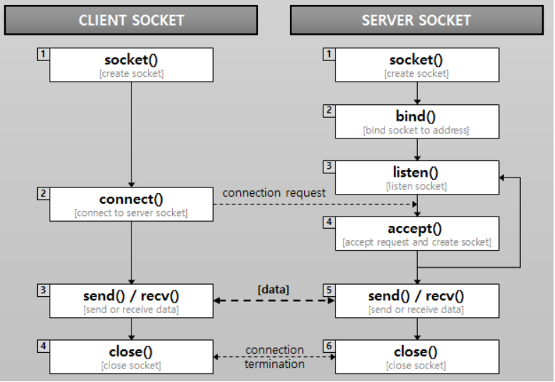

# Network Programming [네트워크 프로그래밍]

- 네트워크로 연결되어 있는 서로 다른 두 컴퓨터가 데이터를 주고받을 수 있도록 하는 것

## 1. Socket 소켓

    - 물리적으로 연결된 네트워크상에서의 데이터 송수신에 사용할 수 있는 소프트웨어적인 장치
    - 프로세스가 데이터를 송수신하기 위해서는 반드시 소켓을 열어서 소켓에 데이터를 써보내거나 소켓으로부터 데이터를 읽어들여야 한다.
    - 소켓은 프로토콜, IP 주소, 포트 번호로 정의된다.

1) 프로토콜

    - 컴퓨터 상호간의 대화에 필요한 통신규약
    - 서로 데이터를 주고 받기 위해서 정의해 놓은 약속
2) [IP](0.%20IPAddress.md)

    - 전 세계 컴퓨터에 부여된 고유의 식별 주소

3) [포트](0.%20PortNumber.md)

    - 네트워크 상에서 통신하기 위해서 호스트 내부적으로 프로세스가 할당받아야 하는 고유한 숫자
    - 한 호스트 내에서 네트워크 통신을 하고 있는 프로세스를 식별하기 위해서 사용되는 값
    - 같은 호스트 내에서 서로 다른 프로세스가 같은 포트 번호를 가질 수 없다
    - 즉, 같은 컴퓨터 내에서 프로그램을 식별하는 번호

## 2. Flow of Socket Communication
   

    1) Server
        - 클라이언트의 소켓 연결 요청을 대기하고, 연결 요청이 오면 클라이언트 소켓을 생성하여 통신이 가능하게 한다.
    2) Client
        - 실제로 데이터 송수신이 일어나는 것은 클라이언트 소켓이다.

## 3. Type of Socket [How the Socket Transfers Data]

1) 스트림(TCP)
   → 신뢰성 있는 순차적인 바이트 기반의 연결지향 데이터 전송 방식의 소켓
    - 양방향으로 바이트 스트림을 전송, 연결 지향성
    - 오류 수정, 전송처리, 흐름제어 보장
    - 송신된 순서에 따라 중복되지 않게 데이터를 수신 → 오버헤드가 발생
    - 소량의 데이터보다 대량의 데이터 전송에 적합 → TCP를 사용

2) 데이터그램(UDP)
   → 신뢰성과 순차적 데이터 전송을 보장하지 않는, 고속의 데이터 전송을 목적으로 하는 소켓
    - 비연결형 소켓
    - 데이터의 크기에 제한이 있음
    - 확실하게 전달이 보장되지 않음. 데이터가 손실돼도 오류가 발생하지 않음
    - 실시간 멀티미디어 정보를 처리하기 위해 주로 사용

## 4. HTTP 통신과 Socket 통신의 비교

### 1. HTTP 통신

    - Client의 요청(Request)이 있을 때만 서버가 응답(Response)하여 해당 정보를 전송하고 곧바로 연결을 종료하는 방식

* 특징
    - Client가 요청을 보내는 경우에만 Server가 응답하는 단방향 통신이다.
    - Server로부터 응답을 받은 후에는 연결이 바로 종료된다.
    - 실시간 연결이 아니고, 필요한 경우에만 Server로 요청을 보내는 상황에 유용하다.
    - 요청을 보내 Server의 응답을 기다리는 어플리케이션의 개발에 주로 사용된다.

### 2. SOCKET 통신

      - Server와 Client가 특정 Port를 통해 실시간으로 양방향 통신을 하는 방식

* 특징
    - Server와 Client가 계속 연결을 유지하는 양방향 통신이다.
    - Server와 Client가 실시간으로 데이터를 주고받는 상황이 필요한 경우에 사용된다.
    - 실시간 동영상 Streaming이나 온라인 게임 등과 같은 경우에 자주 사용된다.