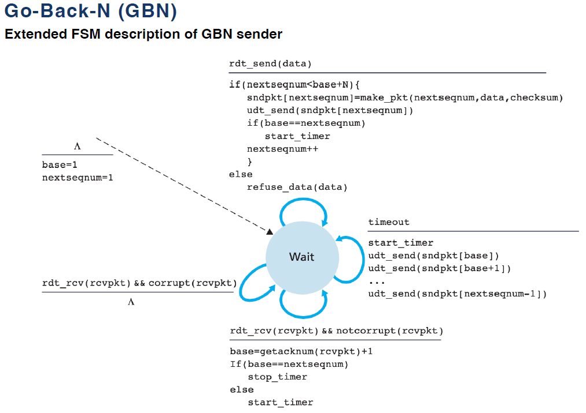
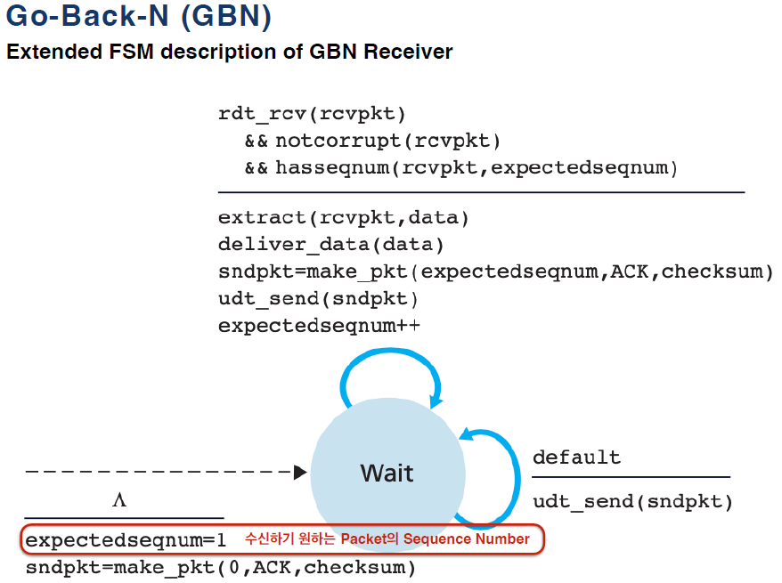
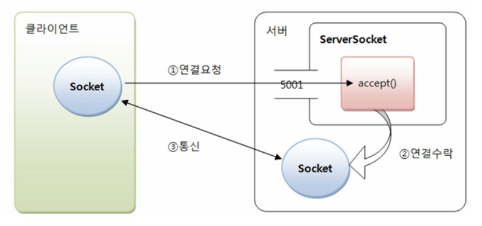

# TCP (Transmission Control Protocol)

## 1. TCP (Transmission Control Protocol)

ㅇ 양종단 호스트 내 프로세스 상호 간에 신뢰적인 연결지향성 서비스를 제공

- IP의 비신뢰적인 최선형 서비스에다가, 신뢰적인 연결지향성 서비스를 추가 제공하게 됨
- 이렇게, IP에 추가적으로 신뢰적인 전송을 보장함으로써, 어플리케이션 구현이 한층 쉬워지게 됨

## 2. 주요 특징

ㅇ 신뢰성 있음 (Reliable)

- 패킷 손실, 중복, 순서바뀜 등이 없도록 보장

ㅇ 연결지향적 (Connection-oriented)

- 같은 전송계층의 UDP가 비연결성(connectionless)인 것과는 달리, TCP는 연결지향적임
    - 연결 관리를 위한 연결설정 및 연결해제 필요

  양단간 어플리케이션/프로세스는 TCP가 제공하는 연결성 회선을 통하여 서로 통신

ㅇ 전이중 전송방식/양방향성 (Full-Duplex)

- 종단간 양 프로세스가 서로 동시에 세그먼트를 전달할 수 있음

ㅇ 멀티캐스트 불가능 : 단대단 전송 방식 (1:1) 즉, 유니캐스트성 임

- 단일 송신자와 단일 수신자 간에 단일 경로 연결이 설정됨

ㅇ 상위 응용과는 바이트 스트림(Byte Stream)으로 주고받음

- 논리적(의미를 갖는) 단위인 메세지 스트림이 아님
  . 각 데이터 간의 구분을 의미적으로 구분하지 않고,
  . 단순히 바이트들의 연속적인 흐름으로 보고, 이들을 묶어 세그먼트화하여 전송

ㅇ 세그먼트화 처리             : 데이터를 패키징 처리

ㅇ 흐름제어 (Flow Control)

- 송신(송신전송률) 및 수신(수신처리율)  속도를 일치시키는 것
  . 주로, `순서번호`,`확인응답번호`,`수신윈도우 크기`라는 3개 변수로 흐름제어

ㅇ 혼잡제어 (Congestion Control)

ㅇ TCP 활용

- 상위 프로토콜 지원 : HTTP, FTP, SMTP 듬
- 응용 지원 : TELNET, rlogin, 웹, 전자우편 등

## 3. TCP Pipelining

→ 확인응답 (Acknowledgements)을 기다리지 않고 여러 Packet을 전송하도록 허용하는 방식을 사용한다.

☑ Sequence Number의 범위가 커져야한다.

    - 각각의 전송 중인 Packet은 유일한 Sequence Number를 가져야한다.

    - Protocol의 Sender와 Receiver은 하나 이상의 Packet을 Buffering 해야한다.

☑ 최소한 Sender는 ACK을 받지 못한 Packet을 Buffering 해야한다.

    - 전송 중이고 확인 응답이 안된 여러 Packet이 있을지도 모르기 떄문이다.

☑ Plpelining 오류 회복의 두 가지 기본적인 접근방법이 있다.

    - Go-Back-N (GBN)
    - Selective Repeat (SR)

## 4. GBN (GO-BACK-N protocol)

1) Sender
   
2) Receiver
   
   → ACK를 기다리지 않고 여러 Packet 전송이 가능하다.

## 실습

### TCP 통신

#### 1. TCP 기반 서버, 클라이언트 구현
[참고 자료](https://jeon0707.tistory.com/130)
1) TCP 서버에서의 기본적인 함수 호출 순서
    - socket() → bind() → ~~listen()~~ → accept() → read()/write() → close()
    - 소켓 생성 → 소켓 주소 할당 → 연결요청 대기상태 → 연결 허용 → 데이터 송수신 → 연결종료
2) 소켓 프로그래밍이란?
    - 소켓을 이용한 통신 프로그래밍을 뜻한다.
    - 소켓(socket)이란, 프로세스간의 통신에 사용되는 양쪽 끝단(end point) 전화할 때 양쪽에 전화기가 필요한 것처럼, 프로세스간의 통신에서도 양쪽에 소켓이 필요하다.
3) 연결 과정
    - 서버가 먼저 실행되어 클라이언트의 요청을 기다리고 있어야 한다.
      1) Server는 서버소켓을 사용해서 서버의 특정 포트에서 클라이언트의 연결 요청을 처리할 준비를 한다.
      2) Client는 접속할 Server의 IP주소와 PORT정보로 Socket을 생성해서 서버에 연결을 요청한다.
      3) Server Socket은 클라이언트의 요청을 받으면 서버에 새로운 Socket을 생성해서 클라이언트의 소켓과 연결되도록 한다.
      4) 이제 Client의 Socket과 새로 생성된 Server의 Socket은 Server Socket과 관계없이 1:1 통신을 한다.