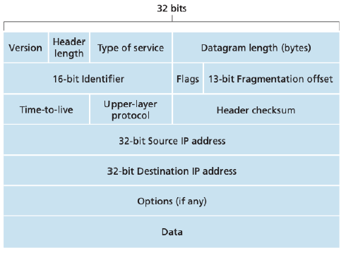

# Internet Portocol

## 1. Data format

1) Version (4bits)
    - IPv4 (0100)
    - IPv6 (0110)

2) Header Length (4bits)
    - IPv4의 헤더길이는 대게 20bytes이다.
    - 해당 값에 5를 곱하면 헤더 길이가 나온다.

3) Type of service (8bits)
    - 서로 다른 유형의 IP Datagram을 구별한다.
    - 제공될 Service Level은 네트워크 관리자가 결정하고 구성할 정책 (Policy) 문제이다
    - Bit 중 두개는 명시적 혼잡 통지 (Explicit Congestion Notification)에 사용된다

4) Datagram length(bytes) (16bits)
    - Byte로 계산한 IP Datagram의 전체 길이이다.
    - 최대 65,535byte 이다.
    - 1500byte보다 클 일은 거의 없다.
    - Payload = Datagram length - Header Length

5) Identifier (16bits)
    - IPv6는 단편화를 허용 하지 않는다.
    - Fragmentation한 경우 패킷 식별 번호
    - 패킷 재조합 시 사용

6) Flags (3bits)
    - 0 : 사용안함, 항상 0이다.
    - D : 0(분할됨), 1(분할 안됨)
    - M : 0(마지막 패킷), 1(뒤에 분할된 패킷이 있음)
7) Fragmentation offset (13bits)
    - 정의된 값 * 8 = 패킷의 삽입 위치

8) TTL : Time-To-Live (8bits)
    - 네트워크에서 Datagram이 무한히 순환하지 않도록하는 역할을 수행. Router 지날때 마다 감소
    - TTL Field가 0이 되면 Router가 Datagram을 폐기한다.

9) Upper-layer protocol (8bits)
    - IP Datagram에서 Data가 전달될 목적지의 Transport Layer의 Protocol을 명시한다.

10) HeaderChecksum (16bits)
    - 오류검출

11) Source IP address (32bits)
    - 자신의 IP 주소를 Source IP Address Field에 삽입한다

12) Destination IP address (32bits)
    - 목적지의 IP 주소를 Destination IP Address Field에 삽입한다.

13) Options (32bits)
    - Option Field를 사용하면 IP 헤더를 확장할 수 있다.
    - Option Field는 거의 사용되지 않는다.
    - Option 처리 유무에 따라 Router에서 IP Datagram을 처리하는데 필요한 시간이 크게 달라질 수 있다.
    - Datagram Header의 길이가 가변적일 수 있기 때문에 Data Field가 시작될 위치를 초기에 결정할 수 없다.

14) Data (32bits)
    - 대부분의 경우 IP Datagram의 Data Field는 목적지에 전달하기 위해 Transport Layer의 Segment를 포함한다
    - IP Datagram의 Data Field에 ICMP와 같은 다른 유형의 데이터를 담기도 한다.

