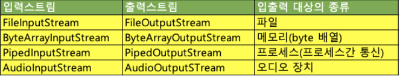
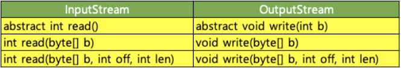
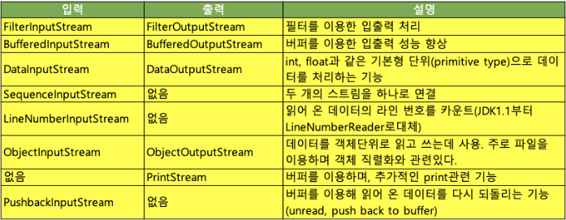

# 바이트 기반 스트림

- 데이터를 바이트 단위로 주고받으며 입출력 대상에 따라 다음과 같은 입출력 스트림을 제공한다.
  
- 이런 여러 입출력 스트림구현체들은 다음과 같은 인터페이스 API를 구현한다.
  
    - read() : 1byte 받아서 반환 / 1byte를 읽을 수 없으면 -1을 반환
    - read(byte[] b) : 내부적으로 read(byte[] b, int off, int len)을 호출 / byte 배열 크기만큼 데이터를 읽고 총 몇 byte를 읽었는지 반환
    - read(byte[] b, int off, int len) : len개의 byte를 읽어서 byte b의 off 위치부터 저장한다.

# 바이트 기반 보조 스트림

- 바이트 기반 스트림의 기능을 향상시키거나 추가 및 보완하기 위해 제공되는 보조 스트림
- 보조 스트림이기에 스트림을 먼저 생성한 다음 이를 이용해 보조 스트림을 생성해야 한다.

```java
        FileInputStream fis=new FileInputStream("text.txt");

        BufferedInputStram bis=new BufferdInputStream(fis);
        bis.read();
```


# 엔디안

    1. 엔디안(Endianness)
        - 컴퓨터의 메모리와 같은 1차원의 공간에 여러 개의 연속된 대상을 배열하는 방법을 뜻한다.
        - 바이트를 배열하는 방법을 특히 바이트 순서(Byte order)라 한다.
    2. 빅 엔디안(Big-Endian)
        - 최상위 바이트(MSB, Most Significant Byte)부터 차례로 저장하는 방식
        - 큰 단위의 바이트가 앞에 오는 방법
        - <- 높은주소 --- 낮은 주소 >
    3. 리틀 엔디안 (Little-Endian)
        - 최하위 바이트(LSB, Least Significant Byte)부터 차례로 저장하는 방식
        - 작은 단위의 바이트가 앞에 오는 방법
        - <- 낮은 주소 --- 높은 주소 >


[참고 사이트](https://catsbi.oopy.io/20112bd1-0d38-48ab-b8bc-c01fded65fab)